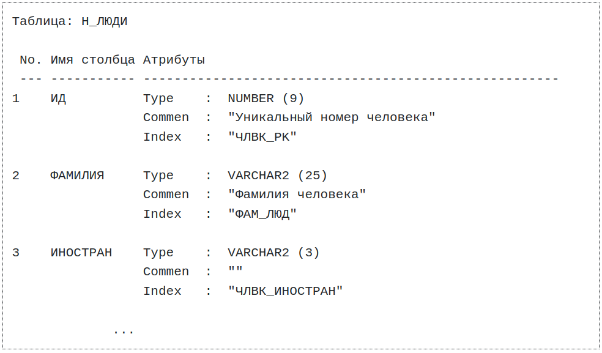

### Лабораторная работа №1

## Задание:
Используя сведения из системных каталогов получить информацию о любой таблице: Номер по порядку, Имя столбца, Атрибуты (в атрибуты столбца включить тип данных, комментарий и индекс).  

Программу оформить в виде процедуры.  

## Реализация:
- [Реализация](./code/main.sql)

## Выполнение:

Для выполнения кода необходимо запустить в терминале psql скрипт `main.sql` для создания процедуры.  
Затем вызвать процедуру:
```
call table_columns_info(<schema_name>, <table_name>);
```